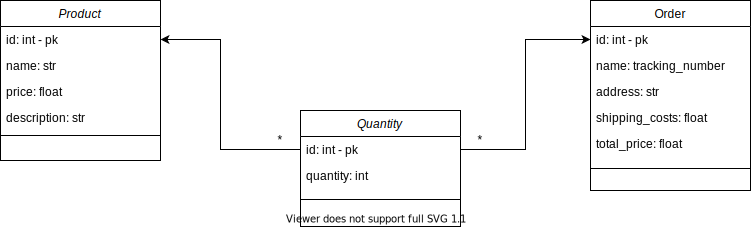

# Django Products
## Introduction
This is a small dockerized API service designed using Django, Django REST Framework, a Redis cache database and Sqlite database. Its purpouse is to manage products and orders.

## Data model

## Structure
Like most Django projects this one has a project package, called **products/**, and an app where the API has been implemented, in the package **api/**. 
Inside **api/** we have the:
- **models** module for the data layer. 
- **serializers** module for *serializing* such data.
- **views** module for handling the API resquests to the data.
- **services** module for the business logic.
- **permissions** module for hadling user access to data.
- **endpoints** module for declaring the API's endpoints.

## Creating the docker image
The we run the following command `$ docker-compose build`.

## Setting up Django
After having our docker image created the next thing is to migrate our Django models to the database. To do that we run `$ docker-compose run products python manage.py migrate`. Then we create a superuser for Django: `$ docker-compose run cars python manage.py createsuperuser`.

## Running the app
In order to run the app we can run the following command `$ docker-compose up`. The local server will be hosted in http://0.0.0.0:8000.

## Test users credentials
| username  | password |
| --------- | -------- |
| superuser | superuser|
| user      | user     |

## API Docs
The API documentantion can be acccessed in the [/api/docs]() url.

